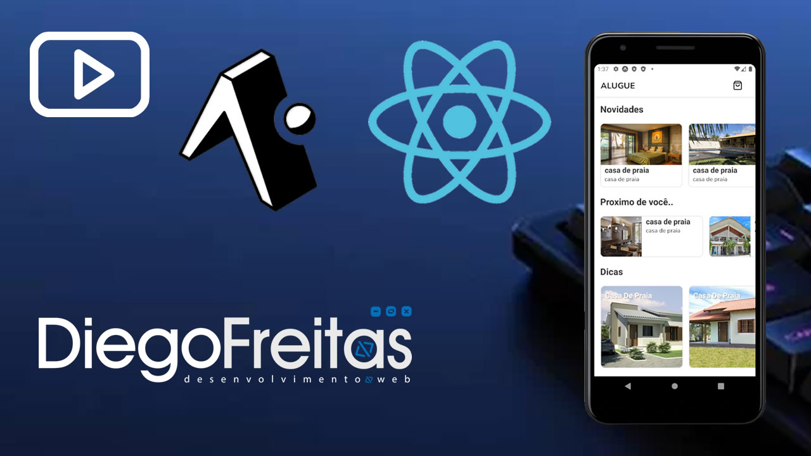

# Sobre

Este projeto constituido com [Expo](https://nodejs.org/), para rodar o projeto faça um clone do [repositorio](https://github.com/diegozfreitas/alugue.git), e instale as dependencias usando npm ou yarn.

```sh
git clone git@github.com:ContratacaoDev/DiegoFreitas-26042022.git copafilmes
cd copafilmes
npm install ou yarn
```

Após o clone do projeto e instalar as dependencias é necessario que voce tenha a [CLI do Expo](https://docs.expo.dev/workflow/expo-cli/) instalada, se tiver execute o comando pelo terminal no diretorio do projeto.

```sh
expo start
```

Deverá abrir no browser o endereço [http://localhost:19002/](http://localhost:19002/), "Expo Developer Tools", caso não abrir basta digitar o endereço no browser e clique em "Run on Android device/emulator" com o emulador aberto ou celular conectado com o cabo.

Estou também disponibilizando na raiz do diretorio um APK para instalar diretamente no celular caso não queira fazer alterações em sua maquina.

# Prints do projeto


# Video sobre o projeto

<a href="https://youtu.be/Bg8lVoCSnf8" target="_blank">
    
</a>

# Video técnico sobre o projeto

<a href="https://youtu.be/lgda6lFk9a4" download >
    
</a>


# Link para fazer o download do APK

<a href="https://www.youtube.com/watch?v=0DuIVes_A6M" target="_blank">
    
</a>
